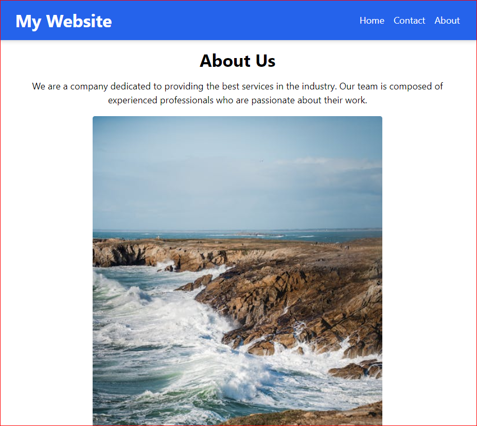

# Professional React Website

A professional-looking website built with React and styled with Tailwind CSS.


## Description

This project is a simple yet professional website that includes a header with navigation links, a content section, and a footer. The website is built using React and styled with Tailwind CSS for a modern, responsive design.


## Features

- **Header**: Includes a logo and navigation links to Home, Contact, and About pages.
- **Home Page**: Features a hero section, services, and testimonials.
- **Contact Page**: Includes a contact form for users to reach out.
- **About Page**: Provides information about the company, its mission, and its vision.
- **Footer**: Contains social media icons and company information.


## Installation

To get a local copy up and running, follow these steps:

1. Clone the repository:

   ```bash
   git clone https://github.com/Mithsah1325/Professional-React-Website.git

